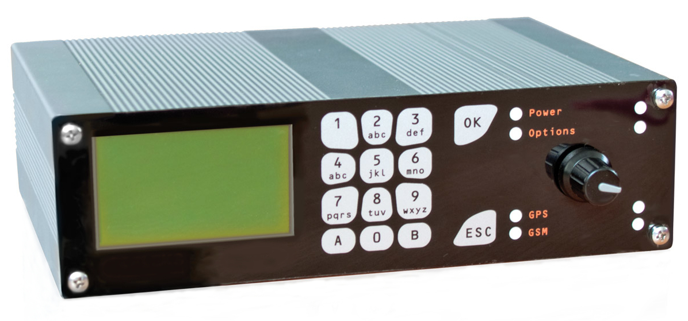
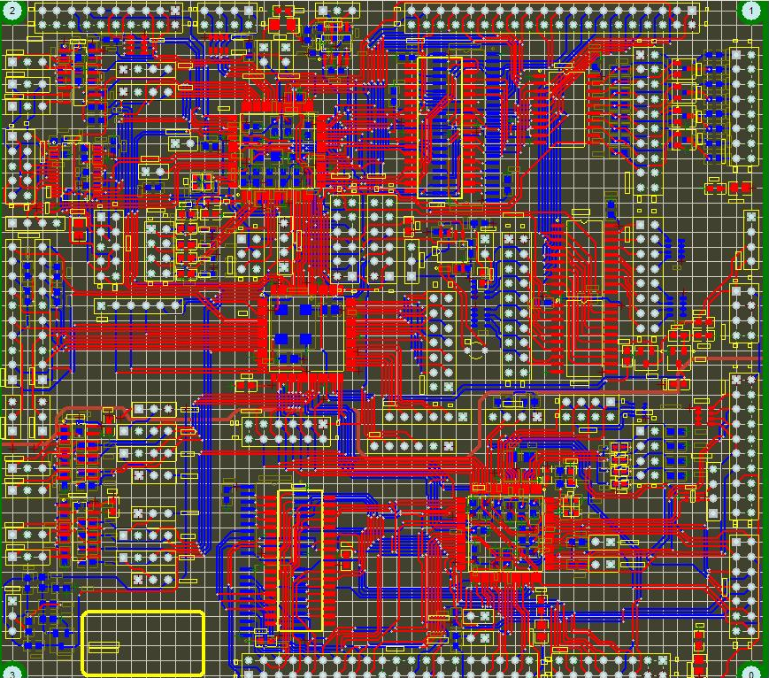
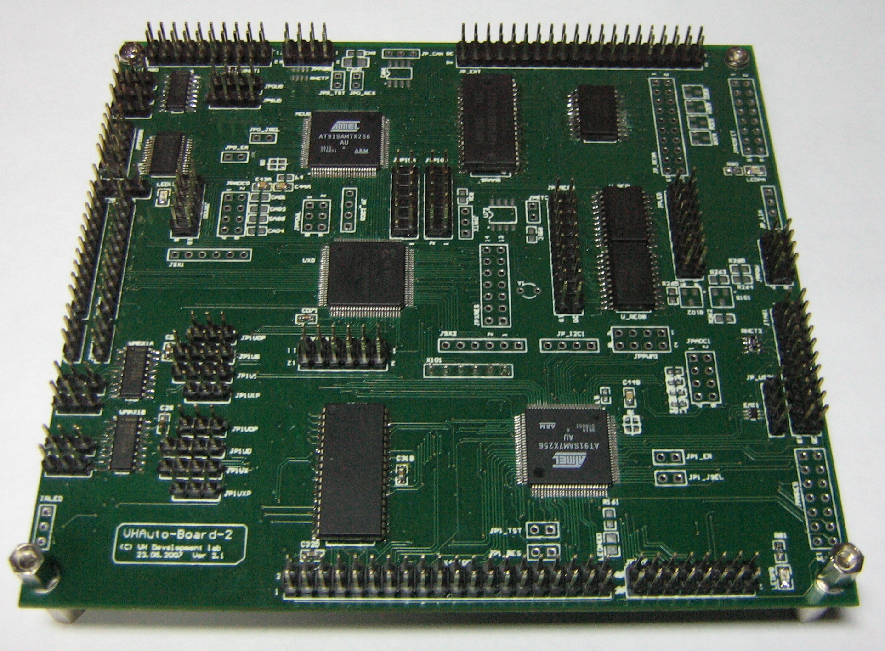
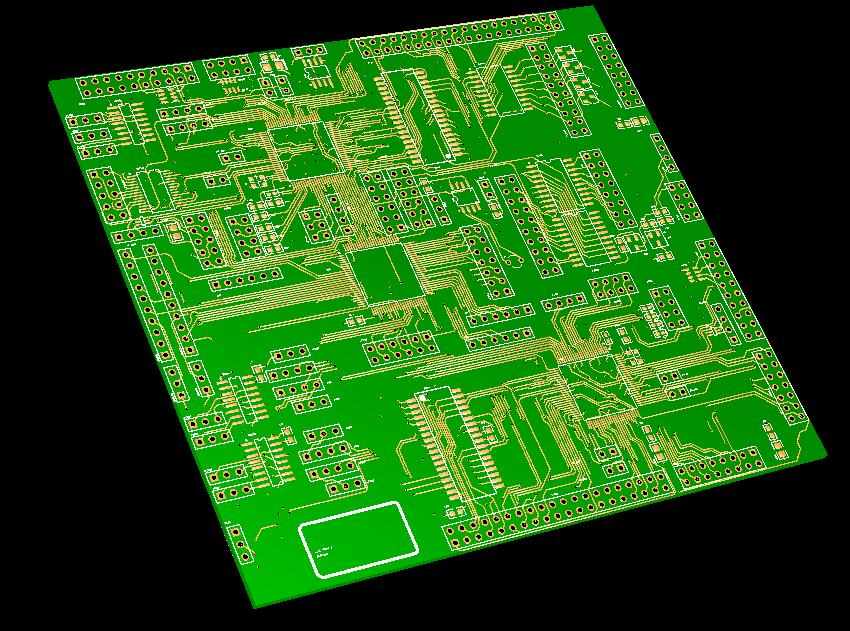
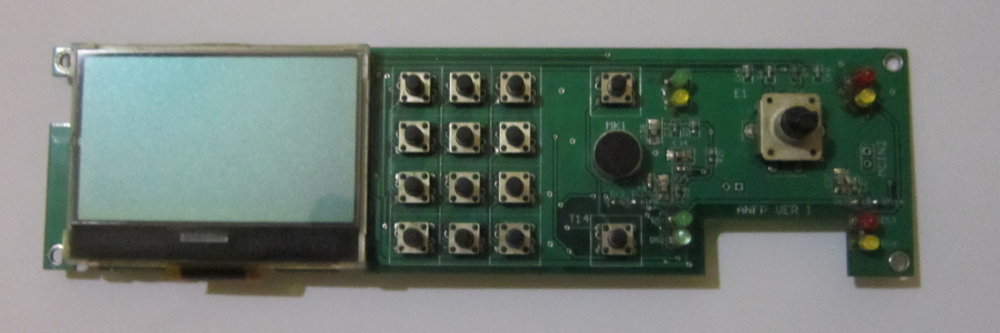
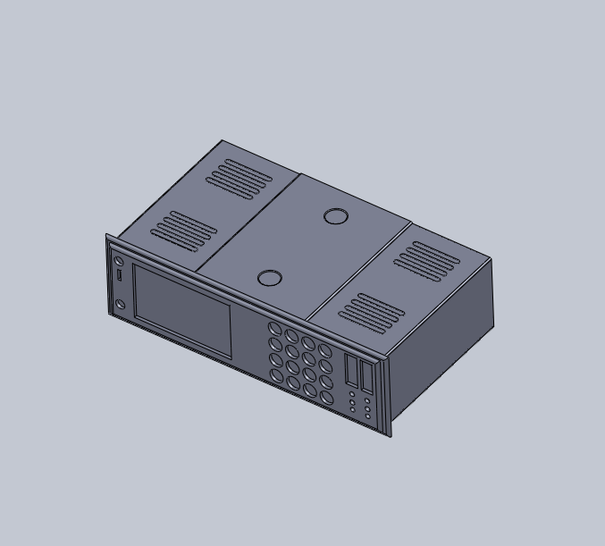
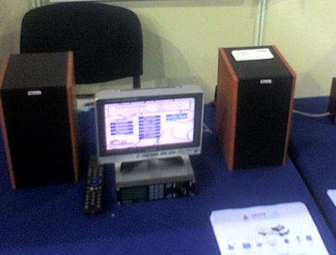
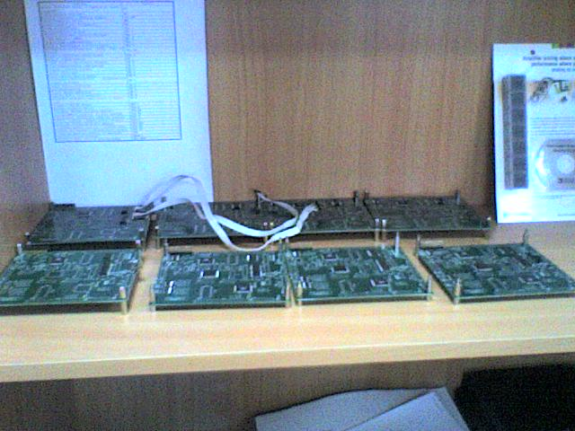
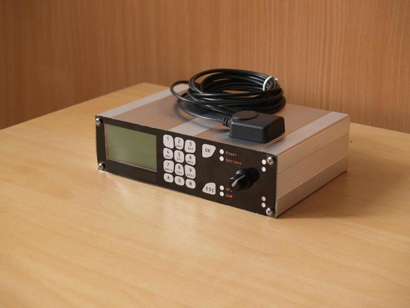

# Project Autonavi 2008

| Property          | Value                         |
|-------------------|-------------------------------|
| Device Released   | Apr 2008                      |
| Author            | Viktor Glebov (V01G04A81)     |
| Series            | Small Series (x10) Prototype  |

---

### Main Device Board

( Designed / May 2007 )

Dual 32-bit ARM MCU Board with CPLD

- x2 32-bit AT91SAM7X256
- x2 SRAM 512 KBytes 
- x3 74HC573 I/O Extender
- x1 Xilinx CPLD XC95144XL
- x1 GPS Interface
- x1 GSM/GPRS Modem Interface
- x4 USART Interface / external devices control
- x1 CAN Interface
- x1 IDE Interface ( reserved for upgrade )
- x1 SD-Card Interface
- x1 I2C RTC

---

 
 

#### Integrated devices

- Main Avtonavi board ( Dual AT91SAM7X256 + XC95144XL )
- Automotive power supply board 12V/24V 
- GPS + GPRS extension board
- Embedded videocard ( Videocard-2008 )
- Embedded MP3 Player ( based on AT91SAM7S64 )
- Front Panel Device with B&W LCD
- LED Panels
- Infrared sensor / Passenger counter

---

<table>
  <tr>
    <td align="center">
       <em>PCB Layout</em>
    </td>
    <td align="center">
       <em>Main Board</em>
    </td>
    <td align="center">
       <em>PCB Layout 3D</em>
    </td>
    
  </tr>
</table>

---

<em>Front Panel Device</em>

---

<table>
  <tr>
    <td align="center">
       <em>Enclosure 3D model</em>
    </td>
    <td align="center">
       <em>Presentation of the device at an automotive and transport expo</em>
    </td>
    <td align="center">
       <em>Devices assembly process</em>
    </td>
    
  </tr>
</table>

---

### PCB Layout

<em>PCB Layout</em>

### PCB Layout 3D

<em>PCB Layout 3D </em>

### Main Board

<em>Main Board</em>

### Assembled Device

<em>Assembled Device</em>

---

Related Links : 

- https://vigatron.github.io/projects/videocard2008 , github - [VideoCARD 2008 Board Details](https://github.com/vigatron/docs/tree/main/projects/videocard2008)
- https://vigatron.github.io/projects/led2008 , github - [LED Panels 2008](https://github.com/vigatron/docs/tree/main/projects/led2008)
- Embedded MP3 Player ( --- )
- IR Passanger Counter ( --- )

---

2007-2008 Viktor Glebov (V01G04A81)
