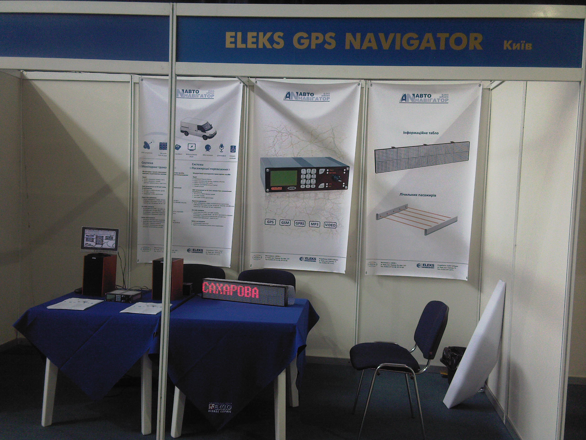
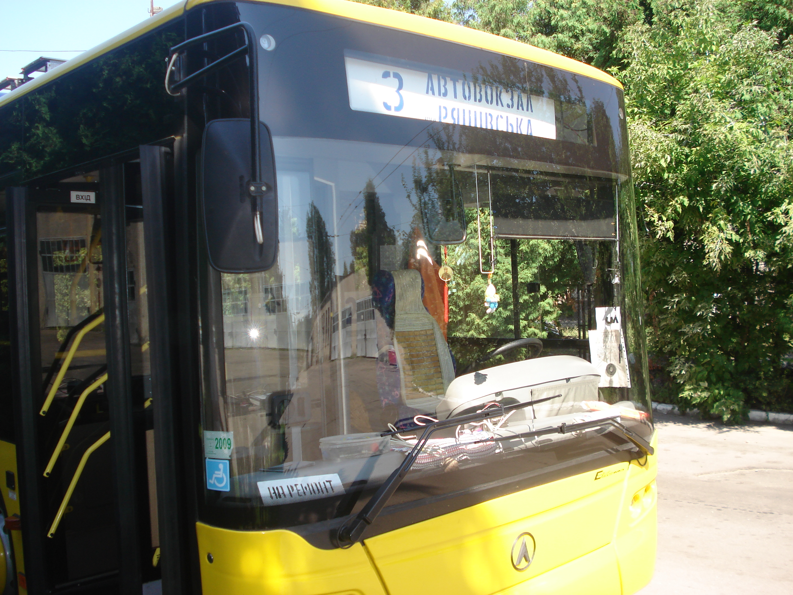
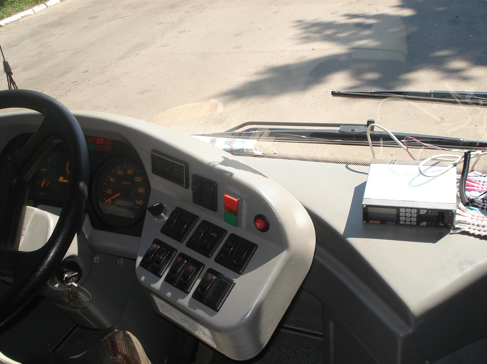
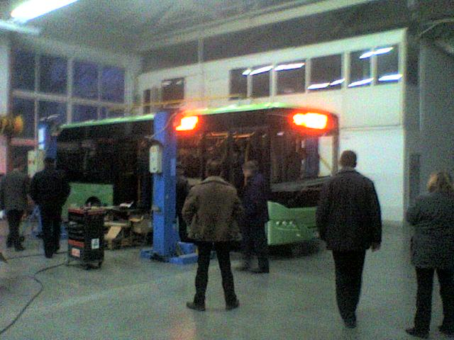
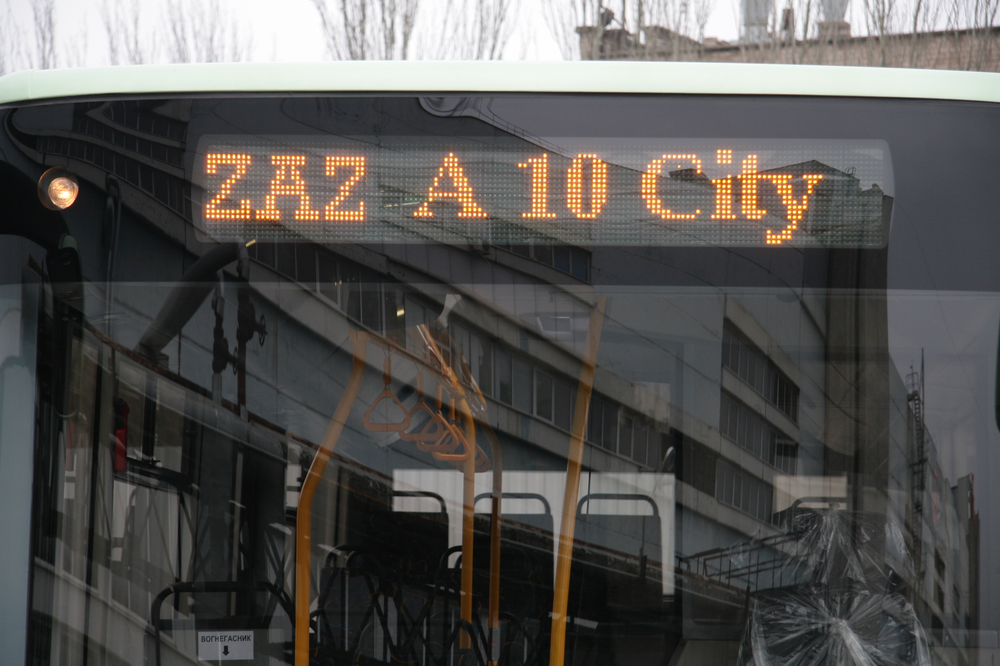
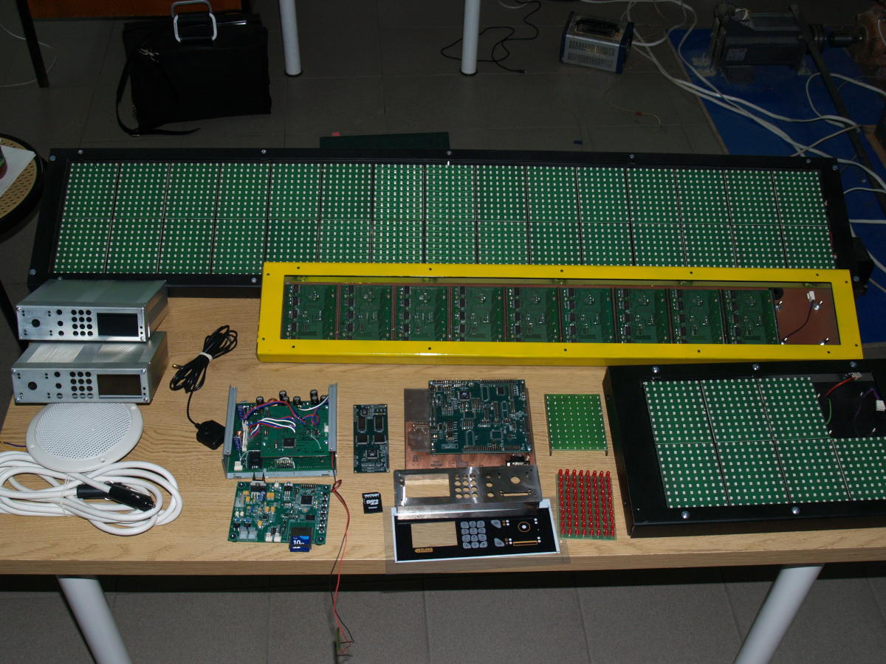
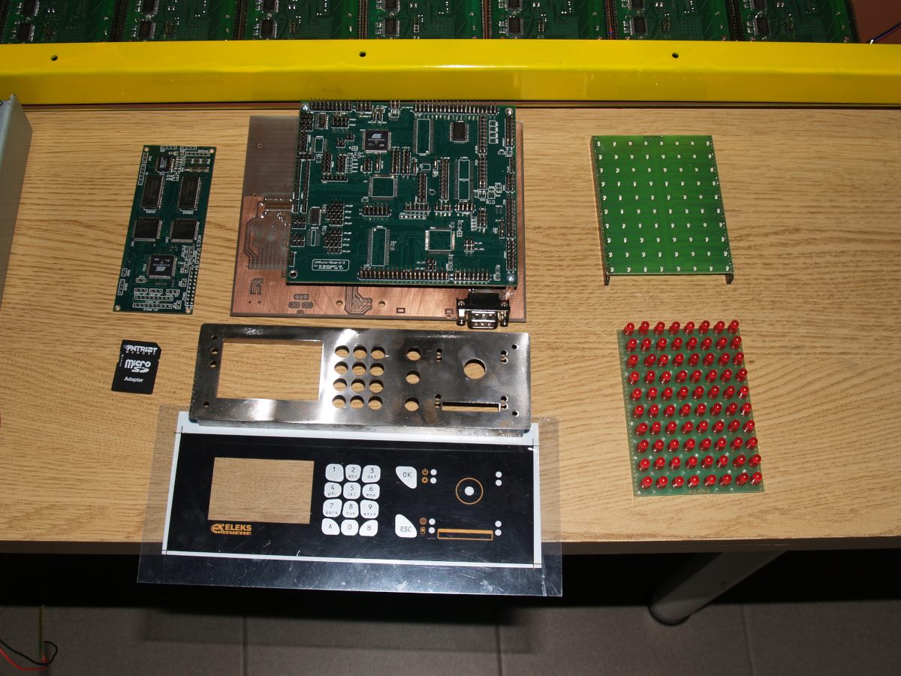

# Autonavigator Transport 2008 Tests
---

Выставка АвтоБус 2008, г. Львов

---

Первая установка: троллейбус маршрут #3 , август 2008 , г. Львов

<table>
  <tr>
    <td align="center">
       <em>Пример #1 256 cells 8x8</em>
    </td>
    <td align="center">
       <em>Пример #2 256 cells 8x8</em>
    </td>
  </tr>
</table>

---

Установка на заводе ( ЗАЗ ) декабрь 2008 , г. Ильичевск

Система отображения маршрутов общественного транспорта на базе LED-панелей с обновлением через SD-карту.

<table>
  <tr>
    <td align="center">
      
    </td>
    <td align="center">
      
    </td>
  </tr>
</table>

---

Немного офисной кухни по сборке и тестов устройств

<table>
  <tr>
    <td align="center">
      
    </td>
    <td align="center">
      
    </td>
  </tr>
</table>

---

Вопрос от ИИ:
>    Чем запомнился проект ?

Ответ:
> Разработчика будили в прямом смысле в 7 часов утра, потому что на завод приезжает Вице-премьер-министр
> и необходимо срочно отредактировать маршрут на табло под новую локацию для презентации.
> Это делалось путем создания файлов в специальной программе, после чего файлы отправлялись по e-mail,
> пользователь переносил их на SD-Card и блок управления считывал файлы - обновлял маршрут и отображение
> всех 3-х табло ( переднее, боковое, заднее )

---

2008 V01G04A81
