### electro-lviv.com 2013-2016

---

### AT91Giga Board ( Own project )

#### Multi-Architecture Emulator Board

   

   
  <em>AT91Giga Board : Year: 2012-2013 </em>

   

&bull; <b>Hardware Stack:</b> ARM 32-bit MCU + FPGA + HDMI Output + SD Card Storage.

&bull; <b>Emulation Targets:</b> 
<ul>
    <li><b>Planned Support:</b> Designed for emulation of <b>x86</b>, <b>MOS 6502</b>, <b>Zilog Z80</b>, and <b>ATmega</b> architectures.</li>
    <li><b>Current Implementation:</b> Partial emulation achieved for <b>x86</b> and <b>ATmega</b> cores.</li>
</ul>

&bull; <b>Technical Progress:</b> 
<ul>
    <li><b>x86 Core:</b> Instruction set is partially implemented; currently developing <b>IRQ handling</b> and system timers.</li>
    <li><b>Status:</b> Project is temporarily <b>on hold</b> due to workload and priority tasks.</li>
    <li><b>Future Goals:</b> Achieving stable BIOS POST and basic DOS compatibility.</li>
</ul>

   

---

   

## Diesel Motor Controller (HOPA Motortuning GmbH / Optimex Import Export GmbH)

&bull; PCB layout design
&bull; Production Test Software & QA

   

<table>
  <tr>
    <td align="center">
      <a href="pics_hopa/hpc_dev.JPG">
         
        <b>Device</b>
      </a>
    </td>
    <td align="center">
      <a href="pics_hopa/HPC_From_Factory.png">
         
        <b>Serie x5</b>
      </a>
    </td>
  </tr>
</table>

   

---

   

## GPS Tracker (Taxi / Dubai)

&bull; Designed full hardware platform (STM32 + SD + audio subsystem)
&bull; Integrated MP3/FM functionality (client requirement)
&bull; Developed PC-side configuration tool (USB)

   

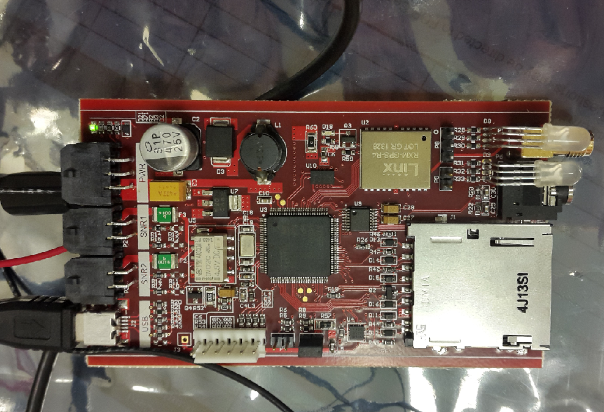 

#### Hardware
* STM32F407
* SD-Card Interface / SPI
* UDA1334 / I2S
* FM Transmitter / I2S
* Serial Flash 16Mb
* USART / GPS
* USB Interface ( STM32-based )

#### Software
* FreeRTOS
* MP3 Decoder Library
* FatFs library
* USB device interface
* GPS / NMEA message Parser / USART
* SD Card & SPI Serial Flash drivers

#### Configuration tool

* GUI / Microsoft C# 
* System Diagnostic & Configuration
* Upload MP3 files via USB Interface
* Download GPS binary data blocks

---

<table>
  <tr>
    <td align="center">
    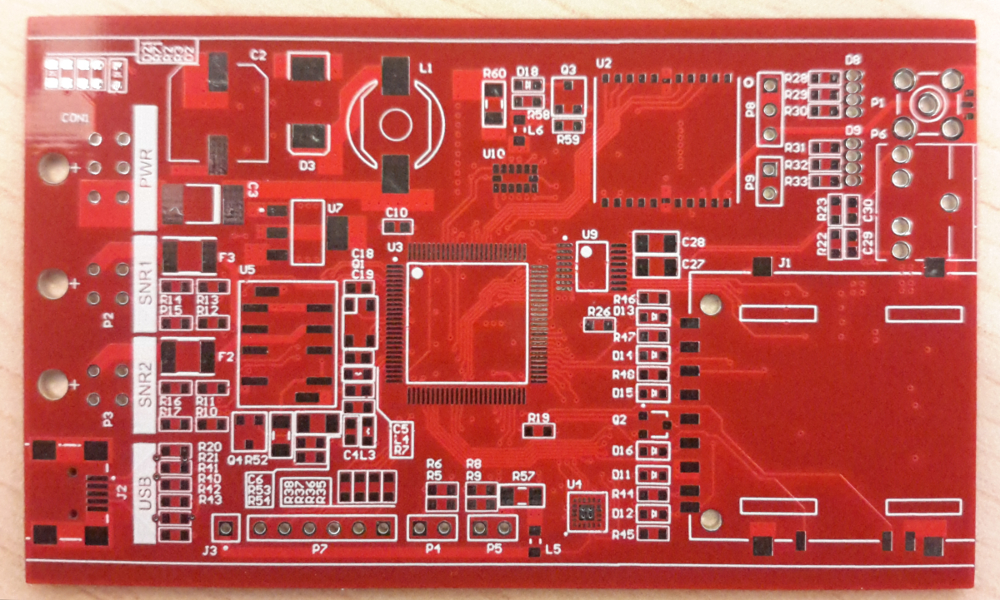 
    </td>
    <td>
    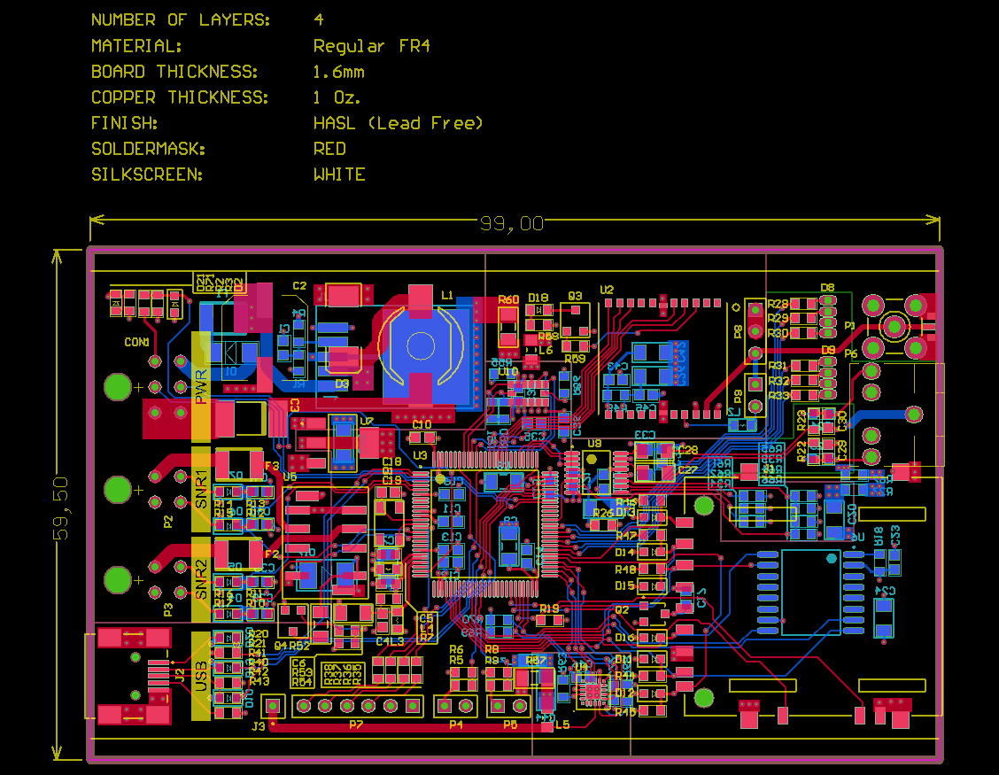 
    </td>
    <td align="center">
    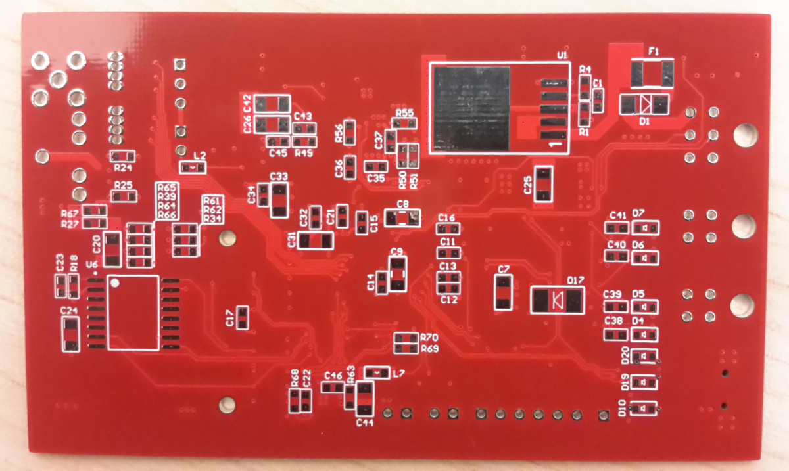 
    </td>
  </tr>
</table>

<table>
  <tr>
    <td align="center">
      <a href="pics_dubai/scr_dubai1.png">
        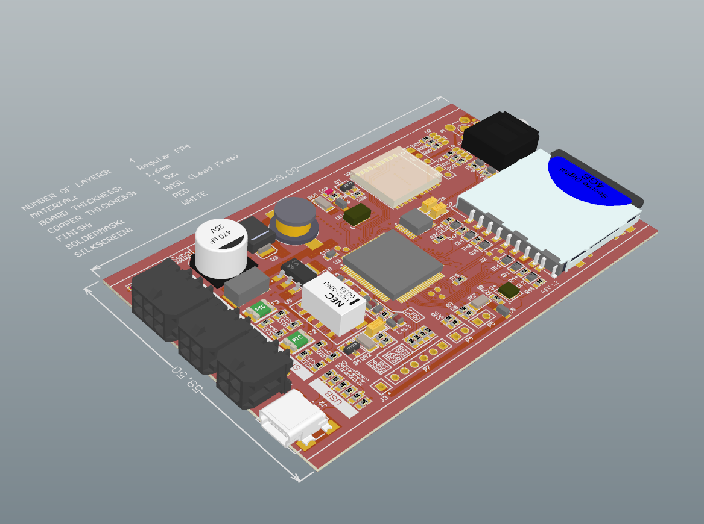 
        <b>Device</b>
      </a>
    </td>
    <td align="center">
      <a href="pics_dubai/scr_dubai2.png">
        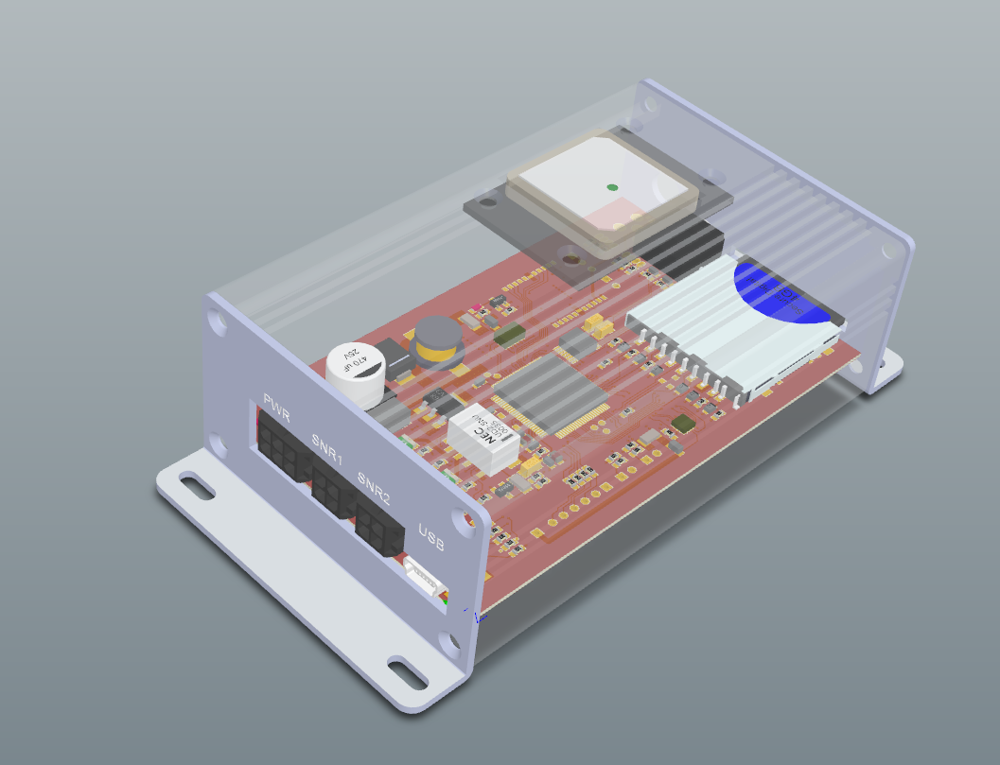 
        <b>Serie x5</b>
      </a>
    </td>
    <td align="center">
      <a href="pics_dubai/scr_dubai3.png">
        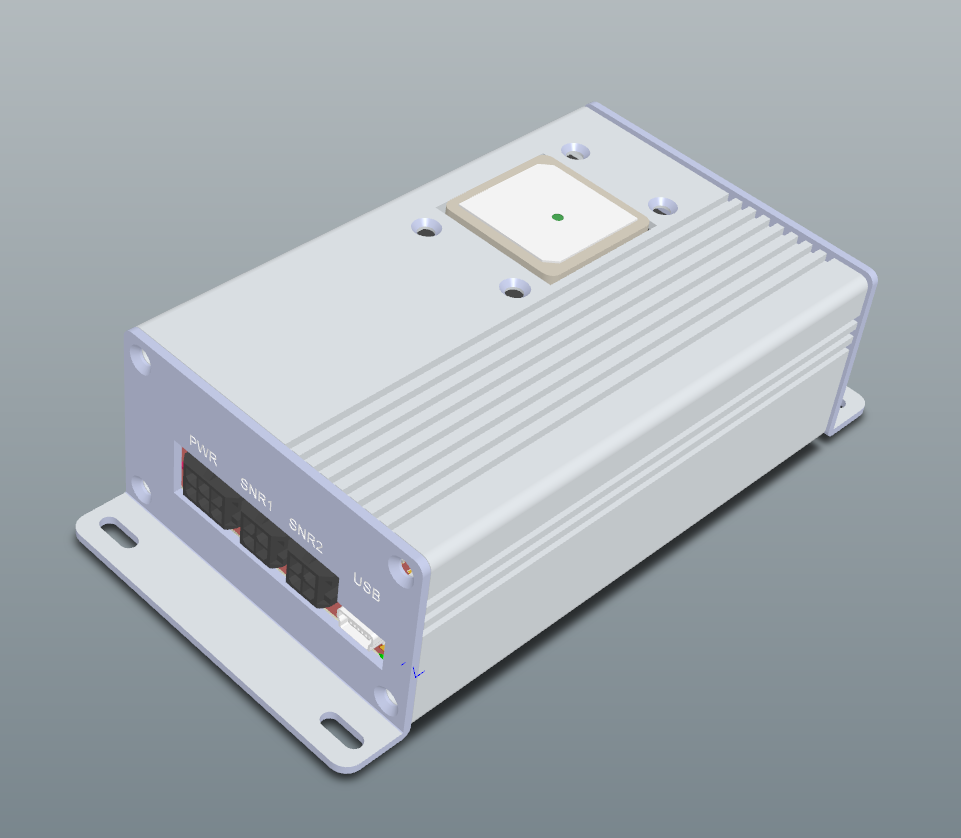 
        <b>3D Model</b>
      </a>
    </td>
  </tr>
</table>

<table>
  <tr>
    <td align="center">
    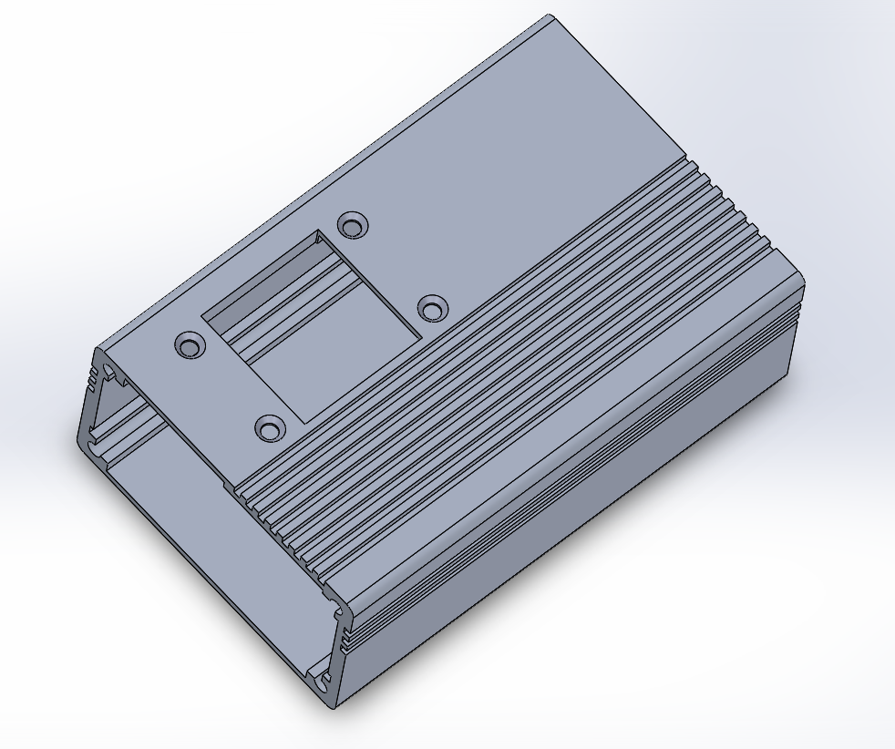 
    </td>
    <td align="center">
    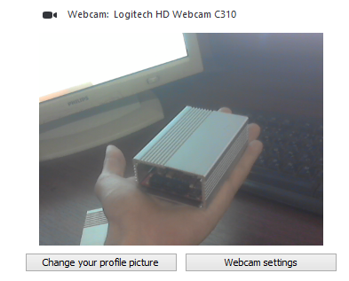 
    </td>
    <td align="center">
    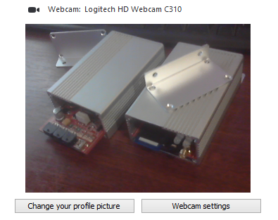 
    </td>
  </tr>
</table>

   

---

   

## Stereo Camera (own project)

&bull; Designed system architecture: STM32 + FPGA + SDRAM
&bull; Dual synchronized camera interface
&bull; HDMI output + WiFi module integration

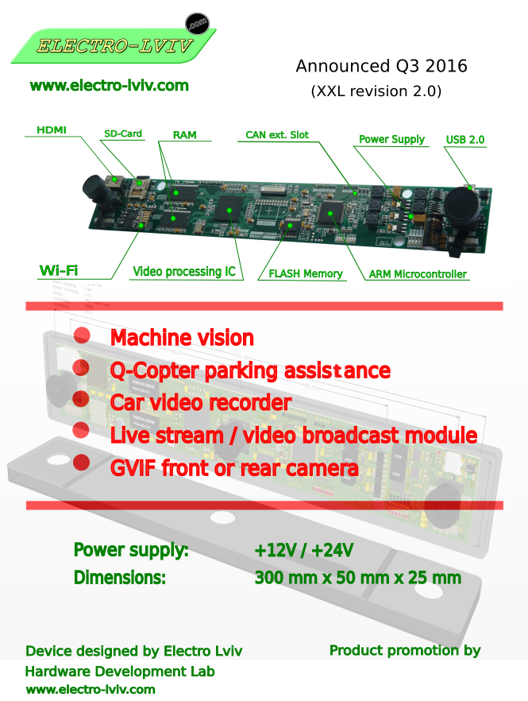

#### Hardware

&bull; STM32F746
&bull; XC6SLX16
&bull; MT48LC16M16A2P-6A x2
&bull; HDMI Output
&bull; Micro SD-Card
&bull; USB Interface

#### Software

&bull; FreeRTOS
&bull; Verilog / Testbenches

#### Key Functionalities

&bull; <b>Traffic Sign Recognition (TSR):</b> Real-time detection and classification of road signs.
&bull; <b>Spatial Estimation:</b> High-precision distance measurement to obstacles using stereo-vision disparity maps.
&bull; <b>Lane Detection & Classification:</b> Identification of road markings and lane boundary types.

 

#### Example

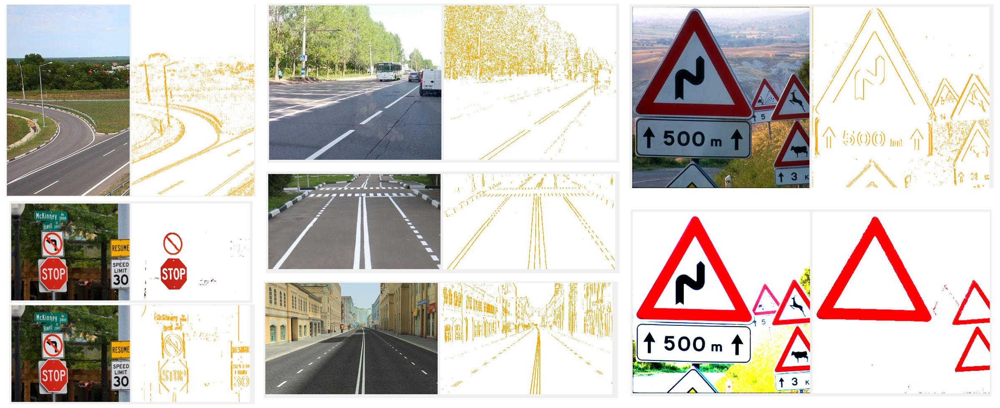

   

---

   

## 3-Axis CNC Controller | Proprietary High-Performance Platform

<i><b>Full-cycle hardware/firmware development with custom "Engrave Version" for client use.</b></i>

&bull; <b>System Ownership:</b> Independently developed a proprietary motion control architecture (STM32 + FPGA + L6472).

&bull; <b>Custom Implementation:</b> Engineered a specialized "Engrave Version" tailored to specific client requirements for precision engraving.

&bull; <b>Architectural Innovation:</b>

+ Transitioned from legacy AVR systems to a high-speed hybrid processing model (proposed Feb 2015).

+ Leveraged FPGA for hardware-level pulse generation to ensure zero-jitter motion control.

&bull; <b>Design Standards:</b> Developed based on STMicroelectronics and Avnet industrial reference designs, ensuring robust EMI/EMC performance.

    Retained full IP rights for the core hardware architecture while delivering a licensed functional module for the client's engraving equipment.

#### Hardware

&bull; STM32F407
&bull; XC6SLX9
&bull; MT48LC16M16A2P-75
&bull; L6472 x3
&bull; Extension I/O port

<i>Status: Gerbers Sent to production 13 Apr 2015</i>

#### Software
&bull; FreeRTOS
&bull; App core
&bull; STM32 peripheral drivers
&bull; L6472 drivers
&bull; VHGUI2016 @ 800x480 port (over SPI, draft)
&bull; Verilog / Testbenches

#### Notes

&bull;  <b>GUI Framework Development:</b>  Iterative evolution of the proprietary interface: VHGUI (v.2002 → v.2008 → v.2012 → v.2016).
 

&bull; <b>Software Releases:</b>

+ <b>v1.0 "Engraver" (Jun 2015):</b> Successful deployment of the functional draft for engraving operations.
+ <b>v2.0 "CNC Pro" (Jan–Apr 2016):</b> Advanced professional version focused on complex 3-axis machining (Stable Beta).

&bull; <b>License Management:</b> Designed and deployed a dedicated <b>License Validation Server</b> (electro-lviv.com/electro-soft) to manage client-side activation (active Nov 2015 – Mar 2016).

   

---

   

## Boiler Controller (2 kW)

&bull; Designed STM32-based control panel
&bull; 4-digit 7-segment LED display
&bull; Implemented user interface (buttons + LED indication)

   

---

   

## KVM Device ( Own project ) DIY PiKVM: Remote PC Control via 100M Ethernet (HDMI In/Out)

 

&bull; STM32 + ETH PHY + XC6SLX100T + SDRAM 166 Mhz + x2 HDMI
&bull; Status: Pending.
&bull; Finding: A reliable solution requires a more complex enterprise-grade system rather than the "simple fix" originally envisioned.

 

  <a href="pics_kvm/kvm1.png">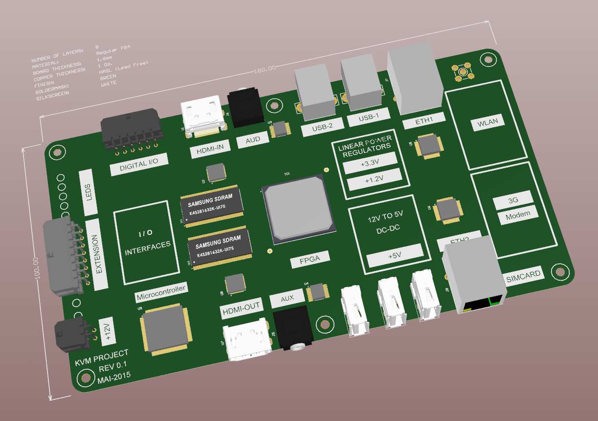</a> 
  <em>KVM Board ( only draft version available from archive ) : Year: 2014-2015 </em>

---
2013-2016 V01G04A81
