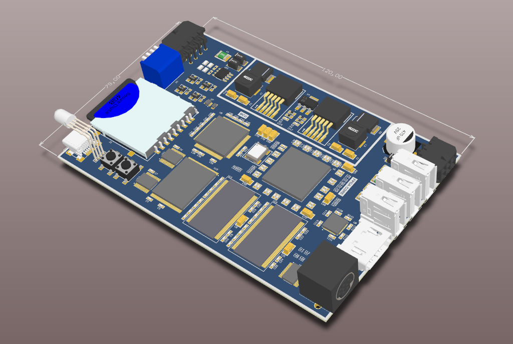
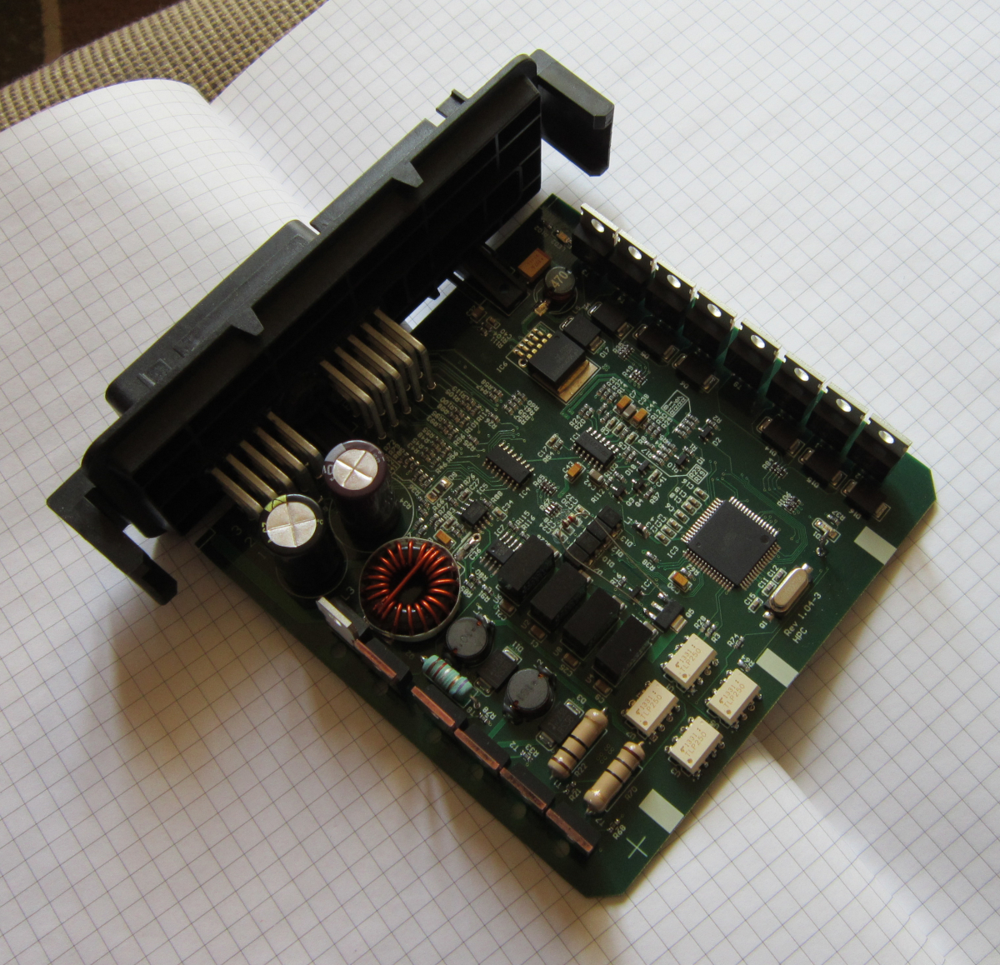
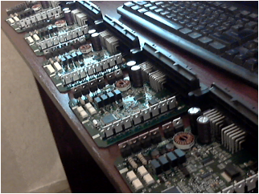
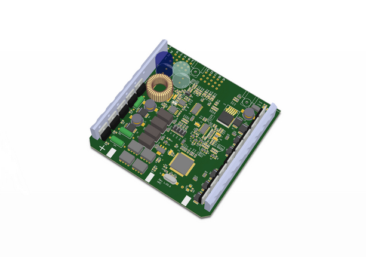

### electro-lviv.com 2012-2016

---

### AT91Giga Board ( own project )

---

#### 1. Multi-Architecture Emulator Board</b>

   
  <em>AT91Giga Board : Year : 2012-2013 </em>

&bull; <b>Hardware Stack:</b> ARM 32-bit MCU + FPGA + HDMI Output + SD Card Storage.

&bull; <b>Emulation Targets:</b> 
<ul>
    <li><b>Planned Support:</b> Designed for emulation of <b>x86</b>, <b>MOS 6502</b>, <b>Zilog Z80</b>, and <b>ATmega</b> architectures.</li>
    <li><b>Current Implementation:</b> Partial emulation achieved for <b>x86</b> and <b>ATmega</b> cores.</li>
</ul>

&bull; <b>Technical Progress:</b> 
<ul>
    <li><b>x86 Core:</b> Instruction set is partially implemented; currently developing <b>IRQ handling</b> and system timers.</li>
    <li><b>Status:</b> Project is temporarily <b>on hold</b> due to workload and priority tasks.</li>
    <li><b>Future Goals:</b> Achieving stable BIOS POST and basic DOS compatibility.</li>
</ul>

---

## Diesel Motor Controller (HOPA / Optimex Import Export GmbH)

&bull; PCB layout design
&bull; Production Test Software & QA

<table>
  <tr>
    <td align="center">
      <a href="pics_hopa/hpc_dev.JPG">
         
        <b>Device</b>
      </a>
    </td>
    <td align="center">
      <a href="pics_hopa/HPC_From_Factory.png">
         
        <b>Serie x5</b>
      </a>
    </td>
    <td align="center">
      <a href="pics_hopa/hpc3d.jpg">
         
        <b>3D Model</b>
      </a>
    </td>

  </tr>
</table>

---

## GPS Tracker (Taxi / Dubai)

&bull; Designed full hardware platform (STM32 + SD + audio subsystem)
&bull; Integrated MP3/FM functionality (client requirement)
&bull; Developed PC-side configuration tool (USB)

---

## Stereo Camera (own project)

&bull; Designed system architecture: STM32 + FPGA + SDRAM
&bull; Dual synchronized camera interface
&bull; HDMI output + WiFi module integration

---

## CNC Controller (3-axis)

&bull; Proposed alternative architecture (STM32 + FPGA + L6472 drivers)
&bull; Based on open hardware reference designs (ST / Avnet)
&bull; Focus: scalability and improved motion control vs legacy AVR-based systems

---

## Boiler Controller (2 kW)

&bull; Designed STM32-based control panel
&bull; Implemented user interface (buttons + LED indication)

---

## KVM Device ( HDMI In - HDMI Out ) with Ethernet 100M for remote PC Control

&bull; STM32 + ETH PHY + XC6SLX100T + SDRAM 166 + x2 HDMI
&bull; Status: Pending.
&bull; Finding: A reliable solution requires a more complex
enterprise-grade system rather than the "simple fix" originally envisioned.
