### electro-lviv.com 2013-2015 / PCB Gerber Visualization Project

 

| Property          | Value                       |
|-------------------|-----------------------------|
| Started on        | Apr 2013                    |
| First published   | Nov 2013 (Demo)             |
| Stable version    | Jun 2014                    |
| Author            | Viktor Glebov (V01G04A81)   |
| Language          | PHP / JavaScripts           |

 

#### Gerber (RS-274X) and Excellon Parsing Libraries

The implementation supports basic interpretation of PCB manufacturing data, including:
- Aperture definitions and drawing primitives (Gerber)
- Coordinate parsing and tool handling (Excellon)
- Layer data extraction for further visualization or analysis
- Preprocessing for pseudo-3D rendering and web-based viewers

These libraries were developed as part of a web-based PCB visualization and analysis toolchain.

This repository contains PHP and JavaScript libraries for parsing and processing Gerber (RS-274X) and Excellon (drill) files.

- [View source code](https://github.com/vigatron/vigatron.github.io/tree/main/projects/elviv2012/src_gcode_part/)

  

<table>
  <tr>
    <td align="center">
      <a href="pics_web/pcb3dvis.png">
         
        <b>PCB 3D Visualization</b>
      </a>
    </td>
    <td align="center">
      <a href="pics_web/icsdb.png">
         
        <b>BOM Manager</b>
      </a>
    </td>
  </tr>
</table>

<table>
  <tr>
    <td align="center">
      <a href="pics_web/gcode1.png">
         
        <b>Gerber Files Viewer</b>
      </a>
    </td>
    <td align="center">
      <a href="pics_web/gcode2.png">
         
        <b>Gerber Files Viewer (Zoom)</b>
      </a>
    </td>
  </tr>
</table>

  

---

### AT91Giga Board ( Own project )

| Property          | Value                       |
|-------------------|-----------------------------|
| Started on        | Aug 2013                    |
| Author            | Viktor Glebov (V01G04A81)   |

#### Multi-Architecture Emulator Board

 

   
  <em>AT91Giga Board : Year: 2012-2013 </em>

 

&bull; <b>Hardware Stack:</b> ARM 32-bit MCU + FPGA + HDMI Output + SD Card Storage.

&bull; <b>Emulation Targets:</b> 
<ul>
    <li><b>Planned Support:</b> Designed for emulation of <b>x86</b>, <b>MOS 6502</b>, <b>Zilog Z80</b>, and <b>ATmega</b> architectures.</li>
    <li><b>Current Implementation:</b> Partial emulation achieved for <b>x86</b> and <b>ATmega</b> cores.</li>
</ul>

&bull; <b>Technical Progress:</b> 
<ul>
    <li><b>x86 Core:</b> Instruction set is partially implemented; currently developing <b>IRQ handling</b> and system timers.</li>
    <li><b>Status:</b> Project is temporarily <b>on hold</b> due to workload and priority tasks.</li>
    <li><b>Future Goals:</b> Achieving stable BIOS POST and basic DOS compatibility.</li>
</ul>

 

---

  

## Diesel Motor Controller (HOPA Motortuning GmbH / Optimex Import Export GmbH)

| Property          | Value                       |
|-------------------|-----------------------------|
| Started on        | Dec 2013                    |
| Gerbers Completed | Feb 2014                    |
| Author            | Viktor Glebov (V01G04A81)   |

&bull; PCB layout design  
&bull; Production Test Software & QA  

  

<table>
  <tr>
    <td align="center">
      <a href="pics_hopa/hpc_dev.JPG">
         
        <b>Device</b>
      </a>
    </td>
    <td align="center">
      <a href="pics_hopa/HPC_From_Factory.png">
         
        <b>Serie x5</b>
      </a>
    </td>
  </tr>
</table>

  

---

  

## GPS Tracker (Taxi / Dubai)

| Property           | Value                       |
|--------------------|-----------------------------|
| Started on         | Sep 2014                    |
| Gerbers Completed  | Oct 2014                    |
| Embedded Software  | Feb 2015                    |
| GUI Tools & Config | Mar 2015                    |
| Tests on           | Apr 2015                    |
| Author 1           | V01G04A81                   |
| Author 2           | Sprk81                      |

 

&bull; Designed full hardware platform (STM32 + SD + audio subsystem)  
&bull; Integrated MP3/FM functionality (client requirement)  
&bull; Developed PC-side configuration tool (USB)  

 

 

#### Hardware
* STM32F407
* SD-Card Interface / SPI
* UDA1334 / I2S
* FM Transmitter / I2S
* Serial Flash 16Mb
* USART / GPS
* USB Interface ( STM32-based )

#### Software
* FreeRTOS
* MP3 Decoder Library
* FatFs library
* USB device interface
* GPS / NMEA message Parser / USART
* SD Card & SPI Serial Flash drivers

#### Configuration tool

* GUI / Microsoft C# 
* System Diagnostic & Configuration
* Upload MP3 files via USB Interface
* Download GPS binary data blocks

---

<table>
  <tr>
    <td>
     
    </td>
    <td>
     
    </td>
    <td>
     
    </td>
  </tr>
</table>

<table>
  <tr>
    <td>
      <a href="pics_dubai/scr_dubai1.png">
         
        <b>Device</b>
      </a>
    </td>
    <td>
      <a href="pics_dubai/scr_dubai2.png">
         
        <b>Serie x5</b>
      </a>
    </td>
    <td>
      <a href="pics_dubai/scr_dubai3.png">
         
        <b>3D Model</b>
      </a>
    </td>
  </tr>
</table>

<table>
  <tr>
    <td>
     
    </td>
    <td>
     
    </td>
    <td>
     
    </td>
  </tr>
</table>

  

---

## DGPS Module NEO-7P

| Property                      | Value                       |
|-------------------------------|-----------------------------|
| Started on                    | Dec 2014                    |
| Prototypes assembled          | Mar 2015                    |
| Successfully tested           | Apr 2015                    |

 

<b>NEO-7P GPS module </b>  
Development and selection of the passive antenna circuit configuration (LNA amplifier, SAW filter, GPS Patch antenna).

<b>Enhanced technical description for the project</b>
u-blox NEO-7P is a high-precision GNSS module from the u-blox 7 series (now EOL, succeeded by newer modules like NEO-F9P).  
It supports Precise Point Positioning (PPP) and Differential GPS (DGPS) for accuracy better than 1 meter.

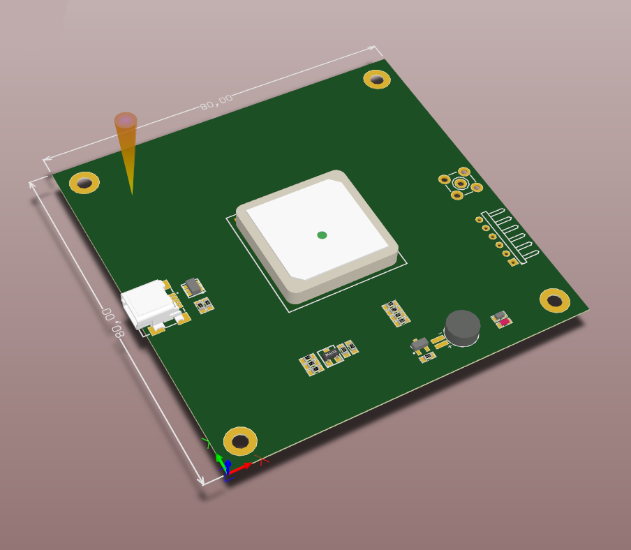

<b>Key features and specifications</b>

+ GNSS support: GPS L1 C/A, GLONASS L1 FDMA, QZSS L1 C/A, SBAS (WAAS, EGNOS, MSAS).
+ Position accuracy:
    * Standalone GPS: ~2.5 m CEP.
    * With SBAS: ~2.0 m CEP.
    * With SBAS + PPP: < 1 m CEP.
+ Sensitivity: Up to -161 dBm (tracking).
+ Time to First Fix (TTFF): Cold start ~30 s, aided ~5 s, reacquisition ~1 s.
+ Channels: 56-channel u-blox 7 engine.

##### 3D Models & PCB

<table>
  <tr>
    <td>
    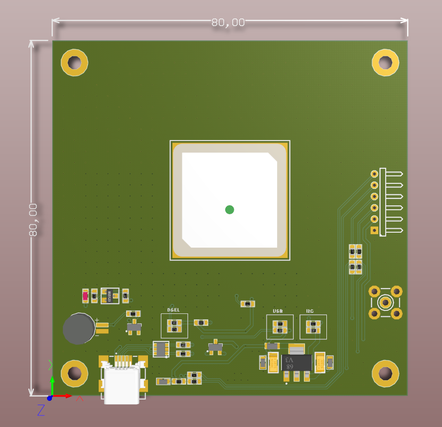
    </td>
    <td>
    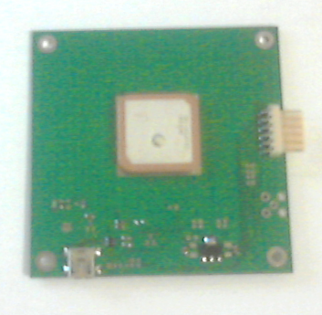
    </td>
    <td>
    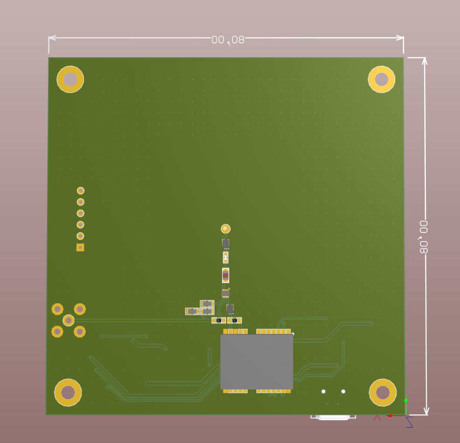
    </td>
    <td>
    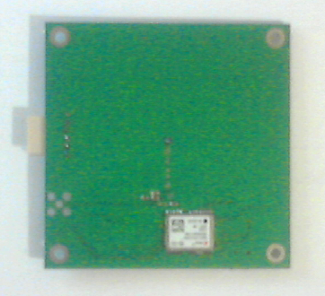
    </td>
  </tr>
</table>

+ PCB manufactoring: ДП ГАЛЬВАНОТЕХНIКА / 3 weeks / x2 prototypes
[viktor_glebov_quittance_2xPCBPlug7.pdf](docs_dgps/viktor_glebov_quittance_2xPCBPlug7.pdf)
 
+ Parts Lists:  [Рахунок_9329.rtf](docs_dgps/Рахунок_9329.rtf)
    * SAW RF FILTER 1575.42 MHZ
    * IC AMP MMIC RF LNA 20DB TSLP-6
    * IC AMP LOW NOISE 6-UDFN

---

## Stereo Camera (own project)

| Property                      | Value                       |
|-------------------------------|-----------------------------|
| Started on                    | Aug 2014                    |
| Partial Emulation Done        | Jan - Apr 2015              |
| Hardware Design Lite + Base   | Aug 2015                    |
| Hardware Design XXL version   | May 2016                    |
| Author                        | Viktor Glebov (V01G04A81)   |

 

&bull; Designed system architecture: STM32 + FPGA + SDRAM  
&bull; Dual synchronized camera interface  
&bull; HDMI output + WiFi module integration  

#### Hardware

<table>
    <thead>
      <tr>
        <th>Mini Version Draft 2013</th>
        <th>Base Version 2014</th>
        <th>XXL Version  2015</th>
      </tr>
    </thead>
<tr>
<td>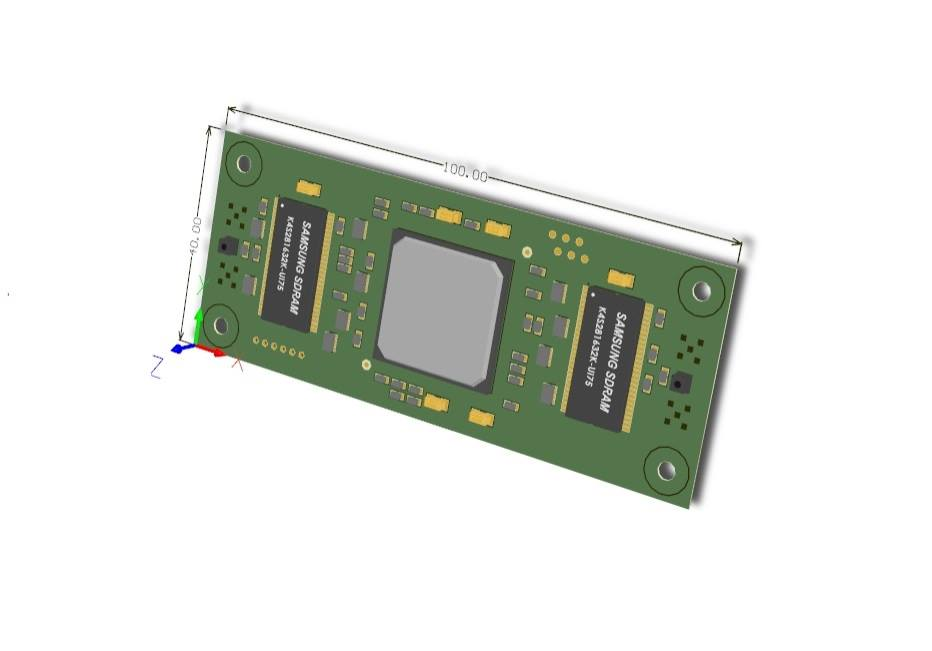</td>
<td>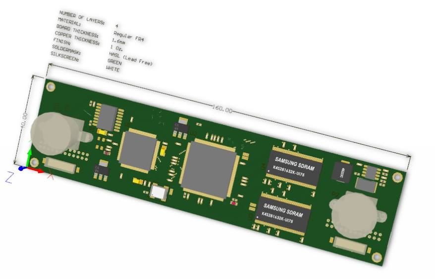</td>
<td>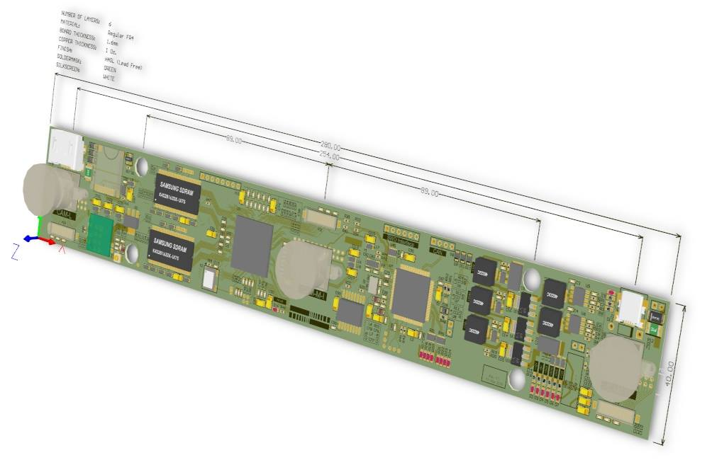</td>
</tr>
<tr>
<td></td>
<td valign="top">
<b>Base Version</b> 
&bull; STM32F407 
&bull; XC6SLX9 
&bull; MT48LC16M16A2P-75 x2 
&bull; USB Interface 
</td>
<td>
<b>XXL Version</b> 
&bull; STM32F746 
&bull; XC6SLX16 
&bull; MT48LC16M16A2P-6A x2 
&bull; HDMI Output 
&bull; Micro SD-Card 
&bull; USB Interface 
</td>
</tr>
</table>

#### Software

&bull; Embedded C/C++
&bull; FreeRTOS  
&bull; VHDL / Verilog + Testbenches  

#### Key Functionalities

&bull; <b>Traffic Sign Recognition (TSR):</b> Real-time detection and classification of road signs.  
&bull; <b>Spatial Estimation:</b> High-precision distance measurement to obstacles using stereo-vision disparity maps.  
&bull; <b>Lane Detection & Classification:</b> Identification of road markings and lane boundary types.  

 

#### Example

  

---

  

## 3-Axis CNC Controller | Proprietary High-Performance Platform

| Property                               | Value                 |
|----------------------------------------|-----------------------|
| Start Date                             | Feb 2015              |
| PCB Design Done                        | Apr 2015              |
| Engrave Software Draft (v1 Beta)       | Jul 2015              |
| Bootloader Draft (v1 Beta)             | Dec 2015              |
| Engrave Software v2 Demo / trade show  | Feb 2016              |
| Engrave Software v2 Stable             | - / unfinished        |
| CNC Software                           | - / unfinished        |
| Server / Client software               | - / unfinished        |

**Contributors:**
- **V01G04A81** — system architecture, hardware design, embedded software development  
- **Sprk81** — hardware abstraction layer (HAL) design, low-level drivers (initial implementation)  
- **GMad** — sensors integration, mechanical system consulting  

<i><b>
Full-cycle hardware/firmware development of a multifunctional CNC controller with a custom "Engrave Version" option for client use.</b></i>  

&bull; <b>System Ownership</b> Independently developed a proprietary motion control architecture (STM32 + FPGA + L6472).  

&bull; <b>Custom Implementation</b> Engineered a specialized "Engrave Version" tailored to specific client requirements for precision engraving.  

&bull; <b>Architectural Innovation</b>
+ Transitioned from legacy AVR systems to a high-speed hybrid processing model (proposed Feb 2015).
+ Leveraged FPGA for hardware-level pulse generation to ensure zero-jitter motion control.

&bull; <b>Design Standards</b>
Developed based on STMicroelectronics and Avnet industrial reference designs, ensuring robust EMI/EMC performance.

Retained full IP rights for the core hardware architecture while delivering a licensed functional module for the client's engraving equipment.

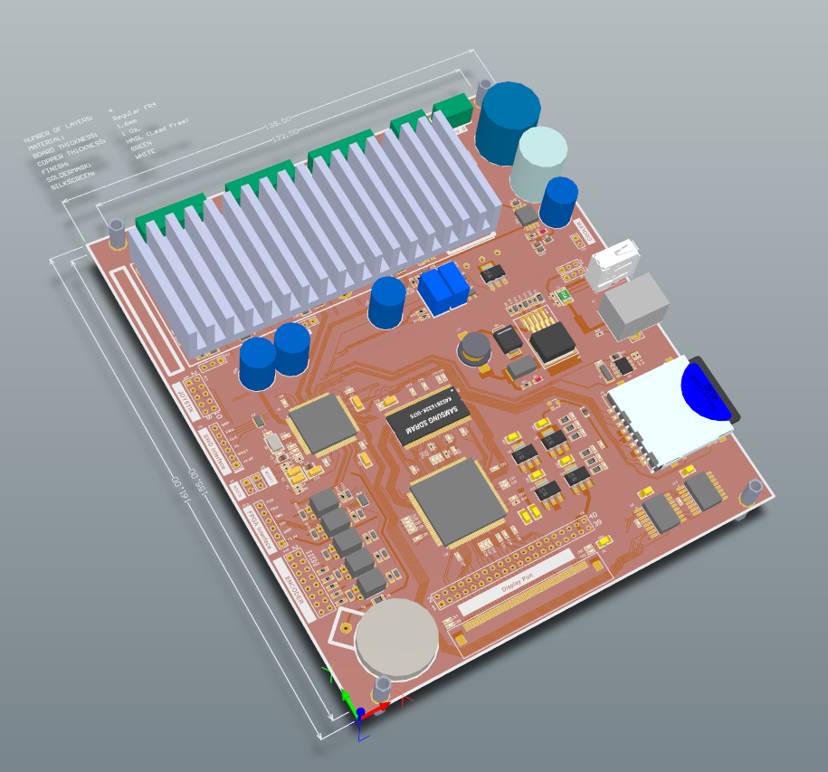
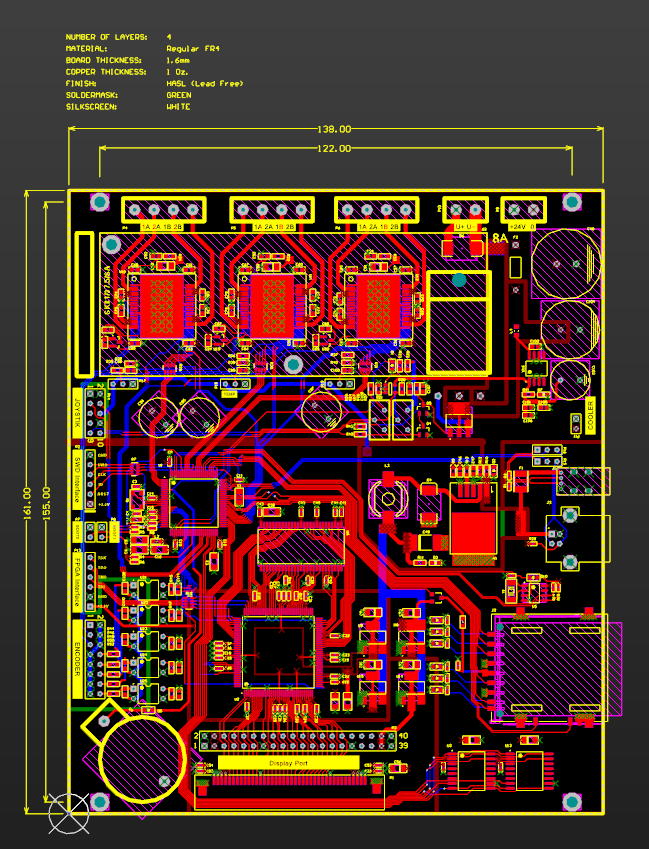
  
<table>
<tr><td valign="top"><b>Hardware</b> 
&bull; STM32F407 
&bull; XC6SLX9 
&bull; MT48LC16M16A2P-75 
&bull; L6472 x3 
&bull; Extension I/O port 
</td>
<td><b>Software</b> 
&bull; FreeRTOS 
&bull; App core 
&bull; STM32 peripheral drivers 
&bull; L6472 drivers 
&bull; VHGUI2016 @ 800x480 port (over SPI, draft) 
&bull; Verilog / Testbenches 
</td>
</tr>
</table>
  
&bull; <b>Status</b>
Gerbers Sent to production 13 Apr 2015  
Manufacturer: BYSCO TECHNOLOGY LIMITED  
Quotation: [The quotation of DraftStanok1 on 13 April 2015](docs_stk/ThequotationofDraftStanok1on13thApril2015.pdf)
Gerbers: [Gerber Files - TOP Layer, Top Silk Layer, KeepOut Layer](docs_stk/stanok1_gerbers_partially_13apr2015.zip)
  
  
> PCB Gerber files authored and submitted to production by V01G04A81 (Apr 2015).  
> A manufacturer quotation (BYSCO TECHNOLOGY LIMITED) was issued to the author upon file submission,  
> confirming authorship of the hardware design. The client subsequently arranged and paid for their own  
> production run under a non-exclusive license. Full IP rights to the hardware architecture are retained by the author.
  
  
 
  
&bull; <b>System configurator</b> - Using Automated Device Layout Systems  
Rapid generation of board architecture, schematics, and PCB layouts  
is enabled by the electro-lviv.com modular design tool.  
It automatically builds the device architecture by arranging off-the-shelf modules  
(ICs database, IC modules, connectors, pinouts, BOM file).  

<i>Note:</i> Component description lists, RLC components, connectors, and ready-made modular assemblies  
are hierarchically organized into a multi-level finished structure.

 

&bull; <b>License Management</b> (electro-lviv.com/electro-soft)
Designed and deployed a dedicated <b>License Validation Server</b>  
to manage client-side activation (active Nov 2015 – Mar 2016).

+ Engrave Machines Licenses
    * Bootloader V1.02015-10-31 02:05:26
    * Engrave Software V1.02015-10-31 02:09:33
    * Engrave Software V1.12015-10-31 02:09:47

+ CNC Controller Licenses
    * CNC Bootloader V1.02015-10-31 01:52:47
    * CNC Application V1.02015-10-31 02:18:25

 

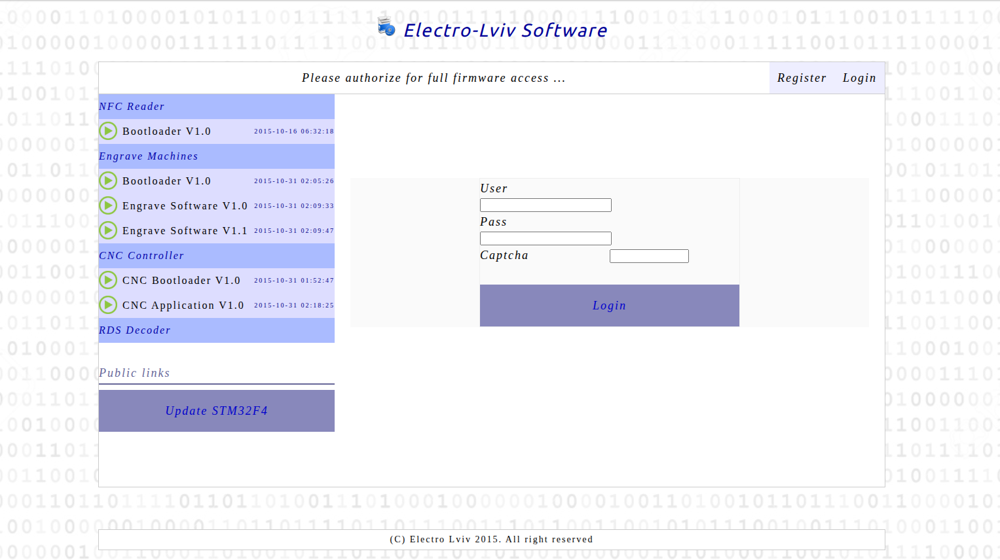  
  
https://web.archive.org/web/20151127081327/http://electro-lviv.com/electro-soft/  
( Wayback Machine Link to License Manager )  

 

&bull;  <b>GUI Framework Development</b>  
Iterative evolution of the proprietary interface: VHGUI (v.2004 → v.2008 → v.2012 → v.2016).

&bull;  <b>Crossplatform Architecture</b> The CNC Pro v2.0 program was developed in C++ / gcc / Windows.
It was launched and debugged in a special emulator without being tied to a specific platform.
GUI and functionality emulation during development was carried out in Windows, after which the program was built for STM32F407 (porting).

&bull; <b>Software Releases:</b>

+ <b>v1.0 Draft "Engraver"   (Jun 2015):</b> Successful deployment of the functional draft for engraving operations.
+ <b>v1.0 Draft "Bootloader" (Dec 2015):</b> Successful deployment of the functional draft. General functionality
+ <b>v2.0 Demo  "Engraver"   (Feb 2016):</b> Ported to STM32F407 specifically for exhibition purposes (equipment showcase).

&bull; <b>Software On Hold:</b>

+ <b>Engrave Software v2.0 Stable</b> Engraver Stable version with features advanced GUI 
+ <b>v2.0 "CNC Pro"  (Jan–Apr 2016):</b> Advanced professional version focused on complex 3-axis machining
+ <b>Server side application:</b>  Uploading and storing tasks (files) by clients + diagnostics
+ <b>Remote Tasks & diagnostic over TCP/IP:</b>  hardware & embedded software for NFC + BT + GPRS features

 

+ Engrave Software v2 (Stable)    | NOT finished or released due to unpridicted conditions / sabotauge from "partner"
+ CNC Software                    | NOT finished or released due to unpridicted conditions / sabotauge from "partner"
+ Server Side software            | NOT finished or released - Remote Tasks over TCP/IP.

Important: 

<i>

> The <b>OnHold</b> status implies that the programs and modules were not released,
> and work on them was not completed due to deliberate sabotage by a partner
> (with the intention of registering and appropriating sole copyright ownership
over the development — unilaterally, without notifying the other partners and deliberately misleading them).

</i>

The client, an entrepreneur specializing in engraving equipment (not CNC controllers), reached out for urgent assistance and shared their story:

<i>

> I need urgent help. Here's what happened — my previous software developer walked out and took the source code with him. Left me with nothing but a compiled binary. Now my clients are dealing with malfunctions and ruined workpieces, and I've got around 30 units out there that all need to be fixed. I'm buying myself time right now — picking up their calls, making excuses — but that's not going to last. Three, maybe four months tops before they completely tear me apart.

</i>

Development proceeded under severely underspecified requirements, with no official documentation, formal specifications, or structured technical references supplied by the client.

> The client presented a dusty PCB with deliberately obscured or scratched-off IC markings (possibly removed from another device). The board was clearly hand-soldered, exhibiting poor soldering quality, residual sticky flux, and bent connectors. Multiple wire jumpers were added to re‑establish connections between traces and IC pins (likely layout corrections or post‑manufacturing fixes). The PCB had no component labeling whatsoever and completely lacked a silkscreen layer. The main controller was an ATMega128 microcontroller, accompanied by three L6472 stepper motor driver ICs.

> The project presented a severe challenge due to a total absence of formal technical documentation. The client could not provide a technical specification or even a precise description of the engraving machine's operations. Instead, the only available materials were vague texts on anonymous sheets of paper, completely lacking signatures, names, company stamps, or any references to a source—essentially generic internet reprints mass-published between 2010 and 2015. Moreover, there was absolutely no information regarding the system architecture, GUI layouts, menu structures, or screen transition logic. Under these conditions, the entire hardware and software development process had to be built from the ground up, driven strictly by my own engineering intuition and understanding of how professional engraving equipment should function. To bridge this massive documentation gap and ensure a reliable design, the system logic was developed using official technical documentation and reference ecosystems from industry leaders, relying heavily on STMicroelectronics for the STM32 MCU and L6472 stepper motor drivers, and Avnet for hardware solutions combining STM32 with Xilinx boards.

---

  

## Boiler Controller (2 kW)

| Property           | Value                       |
|--------------------|-----------------------------|
| Started on         | Mar 2016                    |
| Author             | Viktor Glebov (V01G04A81)   |
| Author             | GMad                        |

&bull; Designed STM32-based control panel  
&bull; 4-digit 7-segment LED display  
&bull; Implemented user interface (buttons + LED indication)  

  

---

  

## KVM Device ( Own project ) DIY PiKVM: Remote PC Control via 100M Ethernet (HDMI In/Out)

| Property           | Value                       |
|--------------------|-----------------------------|
| Started on         | Apr 2015                    |
| Author             | Viktor Glebov (V01G04A81)   |

 

&bull; STM32 + ETH PHY + XC6SLX100T + SDRAM 166 Mhz + x2 HDMI  
&bull; Status: Pending.  
&bull; Finding: A reliable solution requires a more complex enterprise-grade system rather than the "simple fix" originally envisioned.  

 

   
  <em>KVM Board ( only draft version available from archive ) : Year: 2014-2015 </em>

  

---

  

## OBD-II Multi-Protocol Diagnostic Scanner (i.MX23-based)

| Property           | Value                       |
|--------------------|-----------------------------|
| Started on         | Sep 2015                    |
| Gerbers Completed  | Dec 2015                    |
| Author             | Viktor Glebov (V01G04A81)   |

 
Designed and implemented an automotive diagnostic interface supporting CAN (ISO 15765), K-Line (ISO 9141 / KWP2000), and legacy protocols via external transceivers.

<table>
  <tr>
    <td>
     Base board (Top)
    </td>
    <td>
     Base board (Bottom)
    </td>
    <td>
     iMX232 Plug (Top)
    </td>
    <td>
     iMX232 Plug (Bottom)
    </td>
  </tr>
</table>

Developed embedded firmware for ECU communication, DTC decoding, and real-time PID data acquisition.
Implemented hardware architecture including automotive power conditioning, protection circuits, and MCU–peripheral interfacing (UART/SPI).

---
2013-2016 V01G04A81
